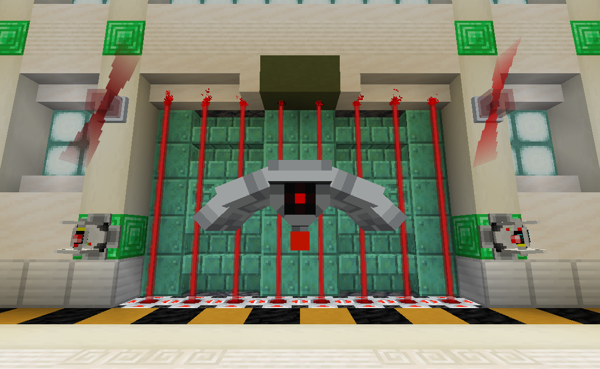

From laser turrets to force fields, Lockdown adds security-themed blocks/items to secure your base against intruders!



A more complete wiki is available [here]()

---

# Version Support

This datapack uses overlays to support multiple versions of the game with a single ZIP file.  However, some features will not be backported to older versions.  Below is a table showing what features are available for each game version.

| Game Version  | Data Pack Version |
| ------------- | ----------------- |
| 1.20-1.20.1   | R2.X              |
| 1.20.2-1.20.6 | ❌               |
| 1.21-1.21.4   | ❌               |
| 1.21.5        | ❌               |
| 1.21.6        | ❌               |
| 1.21.7        | ❌               |
| 1.21.8        | R3                |
| 1.21.9        | ❌               |
| 1.21.10       | ❌               |

---

# Features

## Security

**Encoding Station**: Assigns a code to any encodable device.  The device of choice is placed in the top slot, while three dye representing the code go in the bottom row.

**Keycard reader**: Emits a redstone signal when any player within five blocks holds a keycard with the same code as itself.  Assign a code/channel using the Encoding Station.

**Laser Projector**: When powered, it emits a short-range laser that damages mobs that touch it.

**Alarm Lights**: Emits a rotating glow when it detects a wireless signal from a device on the same channel.  Assign a channel using the Encoding Station.

**Klaxon**: Plays an alarm sound-effect when powered.  Right click the block to cycle between available alarms.

**Force Field Projector**: Projects an indestructible force field when powered.  Right click the block to cycle between different force field sizes, ranging from 1x1 to 5x5.


## Defense

**Defense Turret**: Fires a laser beam at any hostile mob it detects within range.  Will not attack players by default.  However, when assigned a code, it will attack any player whose last held keycard does not match.  Optionally assign a code using the Encoding Station.

**Defense Drone**: Patrols the surrounding area and attacks any hostile mobs it finds using its laser beam.  Will not attack players by default.  However, when assigned a code, it will attack any unrecognized player whose last held keycard does not match.  Optionally assign a code using the Encoding Station.


## Upgrades

**Durability Upgrade**: Increases the health of a drone or turret.

**Flamethrower Upgrade**: Allows drones and turrets to shoot fireballs instead of lasers.

**Range Upgrade**: Increases the effective range of a drone or turret.


## Redstone

**Wireless Transmitter**: When powered, it outputs a wireless signal to any receiver on the same channel.  Assign a channel using the Encoding Station.

**Wireless Receiver**: Outputs a redstone signal when it detects a wireless signal from a device on the same channel.  Assign a channel using the Encoding Station.

**Player Detector**: Outputs a redstone signal when it detects a player within a five-block radius.

**Mob Detector**: Outputs a redstone signal when it detects a mob within a five-block radius.

**Big Buttons**: Similar to a regular button, except more imposing!  Can optionally be assigned a channel to broadcast to using the Encoding Station.

---

# Cheats

You can give yourself all blocks/items in the data pack with the following commands:

```
# R3 and Beyond
/loot give @s loot lockdown:cheat/alarms
/loot give @s loot lockdown:cheat/buttons
/loot give @s loot lockdown:cheat/keycards
/loot give @s loot lockdown:cheat/machines
/loot give @s loot lockdown:cheat/tools
/loot give @s loot lockdown:cheat/upgrades

# R2 and Prior
/function lockdown:give/alarms
/function lockdown:give/blocks
/function lockdown:give/buttons
/function lockdown:give/devices
/function lockdown:give/upgrades
```

---

# Older Versions

Old 1.16 and 1.17 versions are available on the project's GitHub page [here](https://github.com/RedstoneTesseracted/Lockdown/releases)
